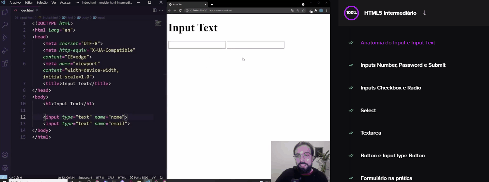

# Projeto dev-quest start
Em busca de aprender a programar encontrei o projeto dos gêmeos do Dev em Dobro e decidir aprender com eles. ✨

Nesse repositório você ira encontrar uma das coisas que aprendi no módulo de HTML intermediário. 🚀

## Tecnologia utilizada
- HTML intermediário

## Como utilizar
### 1- Clone o projeto
- git clone <https://github.com/herbert-vctor/aula-input-text.git>

### 2- Acesse a pasta
- cd 01-input-text

### 3- Abra com o VS-code
- code .

## O que aprendi ?
Como o próprio nome do repositório já diz, eu apredi sobre o atributo (input) e o seu valor padrão (text).

## Dificuldades 
Talvez por ser HTML intermediário ou porque o método de ensino dos gêmeos seja bom; mas eu não tive dificuldades em entender a funcionalidade deste atributo, junto com o seu valor padrão, aprendido na aula.
